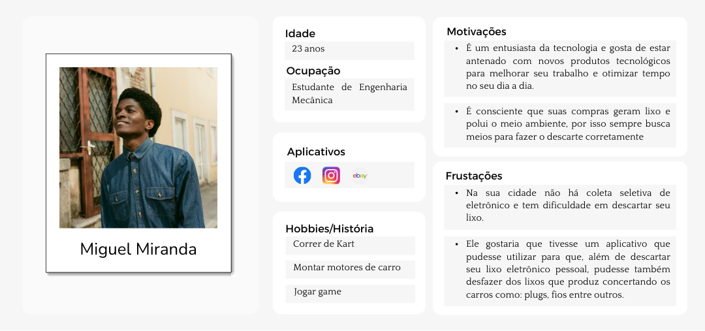
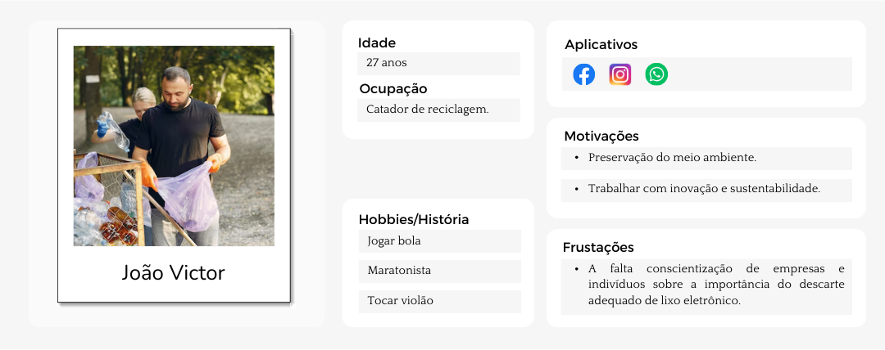
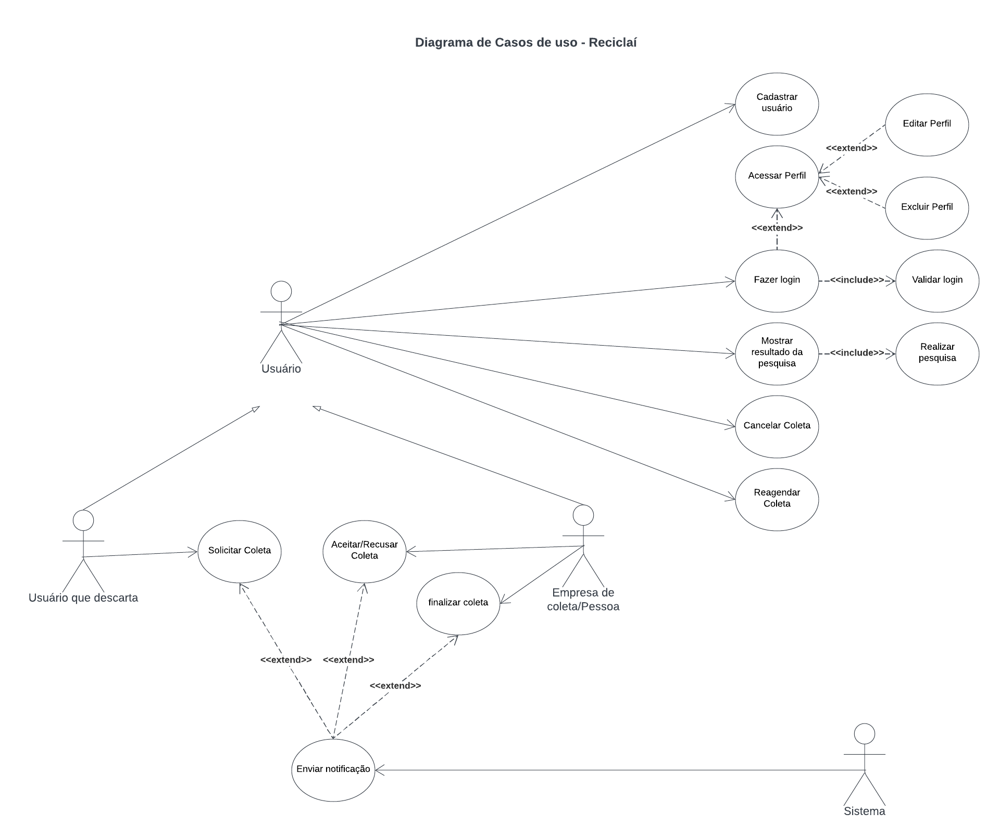
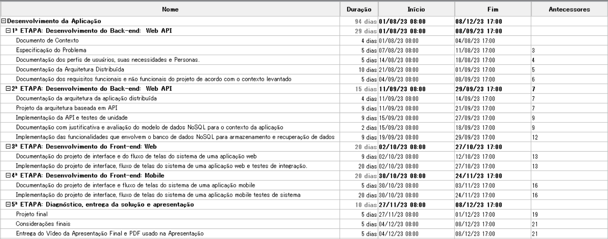

# Especificações do Projeto

Pré-requisitos: <a href="1-Documentação de Contexto.md"> Documentação de Contexto</a>

Definição do problema e ideia de solução a partir da perspectiva do usuário. É composta pela definição do  diagrama de personas, histórias de usuários, requisitos funcionais e não funcionais além das restrições do projeto.

Apresente uma visão geral do que será abordado nesta parte do documento, enumerando as técnicas e/ou ferramentas utilizadas para realizar a especificações do projeto

## Personas

## Histórias de Usuários

Com base na análise das personas forma identificadas as seguintes histórias de usuários:

|EU COMO... `PERSONA`| QUERO/PRECISO ... `FUNCIONALIDADE` |PARA ... `MOTIVO/VALOR`                 |
|--------------------|------------------------------------|----------------------------------------|
|Paula Souza   | Quero um sistema que possibilite receber solicitações de coleta de lixo eletrônico.           | Para realizar o descarte adequado o lixo.  |
|Ayeska Basilio   | Criar um ponto para descarte de lixo eletrônico dos moradores da cidade e entregar esse lixo a empresas que fazem a coleta.            | Para acabar com a falta desse suporte na cidade e para acabar com a poluição das ruas.   |
|Ayeska Basilio   | Conhecer diferentes empresas que trabalhem com coleta de materiais eletrônicos, principalmente recicláveis.            | Expandir a rede de contatos de empresas nesse meio, cooperar com o meio ambiente e transformar um lixo em matéria prima.   |
|Miguel Miranda   | Quer um sistema que seja separado por tipos de lixo eletrônicos como: eletrodomésticos, eletroportáteis, monitores, tecnologia da informação e telecomunicações, fios e cabos, pilhas e baterias, iluminação e painéis fotovoltaicos.             | Para facilitar o descarte e também saber em qual categoria seu lixo é classificado.    |
| Kimburu|  Poder divulgar sobre a empresa e os serviços prestados |   Para atingir pessoas que desconhecem a empresa e incentivar descarte correto|
| Kimburu|  Visualizar quais materiais estão no pedido de coleta   |  Para poder decidir se a coleta será adequada para a empresa       |           
| João Victor | Deseja ter um sistema que possa visualizar quando um usuário solicitar uma coleta de lixo eletrônico   | Para ter uma forma mais simples e segura de descarte.     |           

## Modelagem do Processo de Negócio 

### Análise da Situação Atual

Com o crescente avanço da tecnologia, a cada dia mais dispositivos são criados substituindo os antigos e gerando um acúmulo enorme de lixo eletrônico. No entanto, muitas pessoas ainda não sabem como descartar corretamente esses aparelhos e tem dificuldade para fazê-lo.
Atualmente, a pessoa pode procurar por uma empresa de reciclagem em sites de pesquisa na web, como o google, e entrar em contato diretamente com a empresa para saber como proceder. Algumas empresas possuem sites com formulários de solicitação de coleta e agendamento. Após o envio do formulário, a empresa entra em contato com a pessoa. 

### Descrição Geral da Proposta

Nossa proposta tem como objetivo disponibilizar um sistema no qual as pessoas possam encontrar diversas empresas e catadores de lixo próximos à sua localização. Assim, podem escolher dentre as opções e entrar em contato para solicitar a coleta desse material e destiná-lo para o descarte correto. Esse projeto visa dar mais visibilidade para as empresas de reciclagem e para os catadores de lixo facilitando a conexão das pessoas com eles. 

### Processo Atual – Sistema que fornece agendamento de coletas de lixos recicláveis (Eambiental)

Nesse processo, o usuário solicita à empresa, a coleta de algum material reciclável, preenchendo um formulário, e após isso é redirecionado a uma conversa no whatsapp para acompanhar a solicitação.

### Processo Proposto – Sistema que conecta recicladores com usuários de materiais eletrônicos (Reciclaí)

Nesse processo, pessoas que coletam ou descartam lixo eletrônico se cadastram na plataforma e os mesmos são capazes de se conectarem e solicitar a coleta do material.

Após o usuário entregar a coleta e a empresa/Catador finalizar o processo no APP, o lixo reciclável será de responsabilidade do coletor. 

## Requisitos

As tabelas que se seguem apresentam os requisitos funcionais e não funcionais que detalham o escopo do projeto. Para determinar a prioridade de requisitos, aplicar uma técnica de priorização de requisitos e detalhar como a técnica foi aplicada.

### Requisitos Funcionais

|ID    | Descrição do Requisito  | Prioridade |
|------|-----------------------------------------|----|
|RF-001| O sistema deve permitir que o usuário faça seu cadastro. | ALTA | 
|RF-002| O sistema deve permitir que o usuário realize o login.   | ALTA |
|RF-003| O sistema deve permitir que a empresa receba solicitações de coleta de lixo eletrônico.| ALTA|
|RF-004| O sistema deve permitir que o usuário escolha o tipo de usuário. | ALTA|
|RF-005| O sistema deve ter uma página com os históricos de pedido. | ALTA|
|RF-006| O sistema deve permitir que o usuário escolha uma empresa/pessoa para solicitar a coleta de lixo eletrônico.  | ALTA|
|RF-007| O sistema deve garantir que a empresa tenha os dados da pessoa que deseja a coleta.  | ALTA|
|RF-008| O sistema deve permitir que você informe o que deseja descartar. | ALTA|
|RF-009| O sistema deverá permitir que o usuário possa agendar a coleta do dispositivo eletrônicos em lugares específicos ou por meio de recolhimento programado.  | ALTA|
|RF-010| O sistema deverá categorizar os lixos eletrônicos em 8 categorias: eletrodomésticos, eletroportáteis, monitores, tecnologia da informação e telecomunicações, fios e cabos, pilhas e baterias, iluminação e painéis fotovoltaicos. | ALTA|
|RF-011| O sistema deve ter uma tela com informações sobre o impacto positivo da reciclagem. |Média |
|RF-012 |O sistema deve ter uma página com os pedidos em andamento. |Alta |
|RF-013 |O sistema deve disponibilizar busca por empresas/pessoas que fazem coleta. |Alta| 
|RF-014 |O sistema deve permitir que o usuário altere o tipo de usuário.  |Alta|
|RF-015 |O sistema deve permitir que o usuário apague sua conta. |Alta|
|RF-016 |O sistema deve ter uma página que permita ao usuário visualizar informações sobre as empresas cadastradas. |Média |
|RF-017 |O sistema deve permitir que o coletor recuse uma coleta  . |Alta|
|RF-018 |O sistema deve permitir que o coletor reagende uma coleta  . |Alta|
|RF-019 |O sistema deve permitir que o coletor finalize a coleta. |Alta|
|RF-020 |O sistema deve permitir que o Coletor cancele uma coleta . |Alta|

### Requisitos não Funcionais

|ID     | Descrição do Requisito  |Prioridade |
|-------|-------------------------|----|
|RNF-001| O sistema deve ser responsivo para rodar em um dispositivos móvel | ALTA | 
|RNF-002| O sistema deverá ser capaz, através de um banco de dados, guardar todas as informações das empresas que fazem a coleta. |  ALTA | 
|RNF-003|O aplicativo móvel deverá ser elaborado utilizando React Native.| ALTA|
|RNF-004|O aplicativo deve ter bom nível de contraste entre os elementos da tela em conformidade.| ALTA|
|RNF-005|O sistema deverá garantir a segurança dos dados sensíveis do usuário por meio de criptografia. | ALTA|
|RNF-006|O sistema deve ser capaz de lidar com uma quantidade significativa de registros e transações de forma rápida e eficiente. | ALTA|

## Restrições

O projeto está restrito pelos itens apresentados na tabela a seguir.

|ID| Restrição                                             |
|--|-------------------------------------------------------|
|01| O projeto deverá ser entregue até o final do semestre |
|02| A equipe não pode subcontratar o desenvolvimento do trabalho. |

## Diagrama de Casos de Uso

O diagrama de casos de uso é o próximo passo após a elicitação de requisitos, que utiliza um modelo gráfico e uma tabela com as descrições sucintas dos casos de uso e dos atores. Ele contempla a fronteira do sistema e o detalhamento dos requisitos funcionais com a indicação dos atores, casos de uso e seus relacionamentos. 

# Matriz de Rastreabilidade

A matriz de rastreabilidade é uma ferramenta usada para facilitar a visualização dos relacionamento entre requisitos e outros artefatos ou objetos, permitindo a rastreabilidade entre os requisitos e os objetivos de negócio. 

A matriz deve contemplar todos os elementos relevantes que fazem parte do sistema, conforme a figura meramente ilustrativa apresentada a seguir.

# Gerenciamento de Projeto

De acordo com o PMBoK v6 as dez áreas que constituem os pilares para gerenciar projetos, e que caracterizam a multidisciplinaridade envolvida, são: Integração, Escopo, Cronograma (Tempo), Custos, Qualidade, Recursos, Comunicações, Riscos, Aquisições, Partes Interessadas. Para desenvolver projetos um profissional deve se preocupar em gerenciar todas essas dez áreas. Elas se complementam e se relacionam, de tal forma que não se deve apenas examinar uma área de forma estanque. É preciso considerar, por exemplo, que as áreas de Escopo, Cronograma e Custos estão muito relacionadas. Assim, se eu amplio o escopo de um projeto eu posso afetar seu cronograma e seus custos.

## Gerenciamento de Tempo

Com diagramas bem organizados que permitem gerenciar o tempo nos projetos, o gerente de projetos agenda e coordena tarefas dentro de um projeto para estimar o tempo necessário de conclusão.

O gráfico de Gantt ou diagrama de Gantt também é uma ferramenta visual utilizada para controlar e gerenciar o cronograma de atividades de um projeto. Com ele, é possível listar tudo que precisa ser feito para colocar o projeto em prática, dividir em atividades e estimar o tempo necessário para executá-las.

## Gerenciamento de Equipe

O gerenciamento adequado de tarefas contribuirá para que o projeto alcance altos níveis de produtividade. Por isso, é fundamental que ocorra a gestão de tarefas e de pessoas, de modo que os times envolvidos no projeto possam ser facilmente gerenciados. 

## Gestão de Orçamento

O processo de determinar o orçamento do projeto é uma tarefa que depende, além dos produtos (saídas) dos processos anteriores do gerenciamento de custos, também de produtos oferecidos por outros processos de gerenciamento, como o escopo e o tempo.

