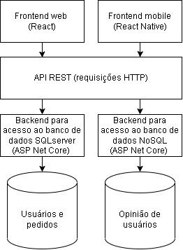
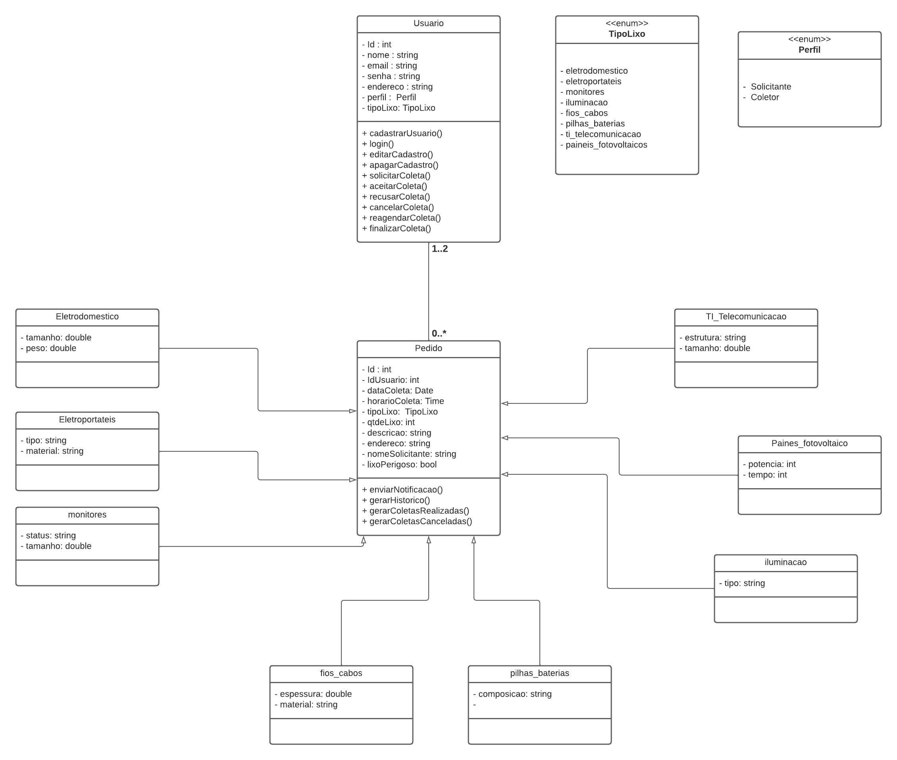
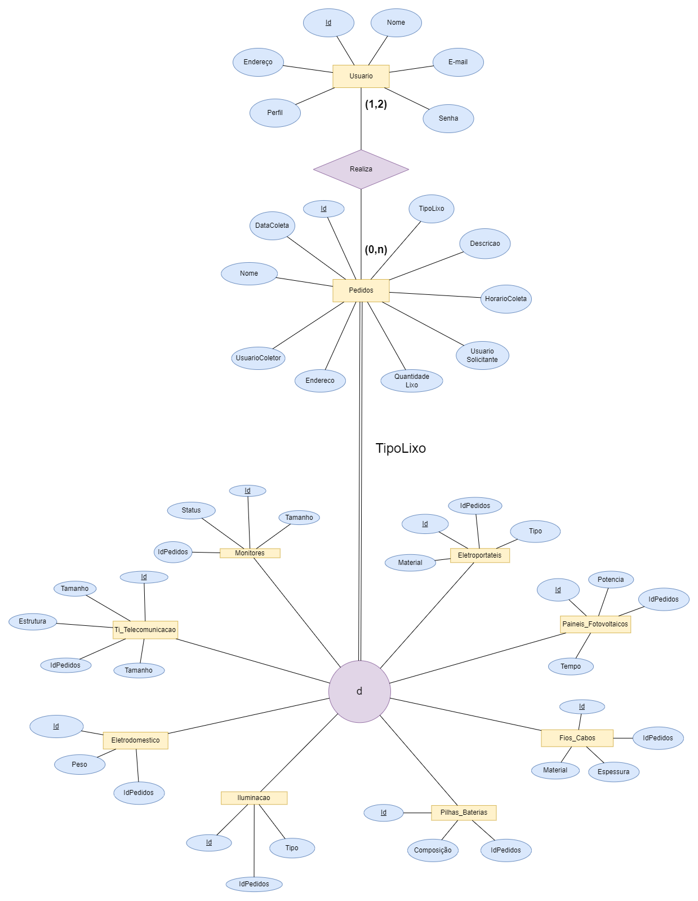
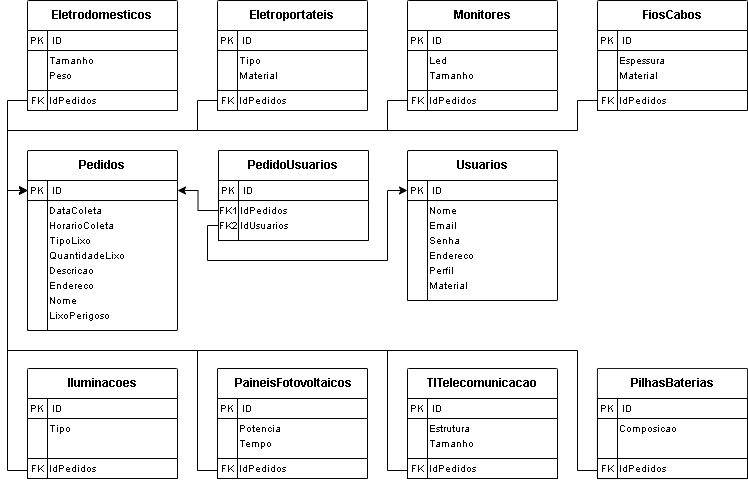

# Arquitetura da Solução

Pré-requisitos: <a href="3-Projeto de Interface.md"> Projeto de Interface</a>

Definição de como o software é estruturado em termos dos componentes que fazem parte da solução e do ambiente de hospedagem da aplicação.

Abaixo, na imagem, temos a representação de como será a arquitetura do projeto, tendo assim um FrontEnd (web e mobile) conectados a uma API Rest e temos dois bancos de dados, um para salvar opiniões de usuários em relação a plataforma/serviço (MongoDb) e outro banco para guardar dados de funcionalidade do sistema (SQL server).

## Diagrama de Classes

O diagrama de classes ilustra graficamente como será a estrutura do software, e como cada uma das classes da sua estrutura estarão interligadas. Essas classes servem de modelo para materializar os objetos que executarão na memória. 

O diagrama apresenta uma classe Usuario, escolhemos utilizar somente uma classe para Usuário e fazer a diferenciação entre usuários por meio do Perfil(enum). A classe Usuario está ligada à classe Pedido na qual consta os atributos e métodos comuns a todos os pedidos. No Pedido pode ser escolhido o tipo de lixo que será coletado e esses tipos estão subdivididos 
 em subclasses que herdam da classe Pedido (Eletrodoméstico, Eletroportáteis, Monitores, Fios e Cabos, Pilhas e baterias, Ti e telecomunicações, Painéis Fotovoltaicos, Iluminação).

__

## Modelo ER

O Modelo ER representa através de um diagrama como as entidades (coisas, objetos) se relacionam entre si na aplicação interativa.

## Esquema Relacional

O Esquema Relacional corresponde à representação dos dados em tabelas juntamente com as restrições de integridade e chave primária.

No esquema temos classes de diferentes tipos de pedidos (Eletrodoméstico, Eletroportáteis, Monitores, Fios e Cabos, Pilhas e baterias, Ti e telecomunicações, Painéis Fotovoltaicos, Iluminação) com uma FK contendo o Id da tabela de pedidos e para fazer a ligação dos pedidos com os usuários, nós temos a tabela PedidoUsuarios, contendo uma FK da tabela de pedidos e uma FK da tabela de Usuarios.
 

## Modelo Físico

Entregar um arquivo banco.sql contendo os scripts de criação das tabelas do banco de dados. Este arquivo deverá ser incluído dentro da pasta src\bd.

## Tecnologias Utilizadas

|Função    | Tecnologia  | 
|------------|-----------------------------------------|
| Linguagem | C# | 
| Framework | API ASP.NET | 
| Bibliotecas |Microsoft.AspNetCore.Authorization; Microsoft.AspNetCore.Http; Microsoft.AspNetCore.Mvc; Microsoft.EntityFrameworkCore; | 
| IDE | Visual Studio | 
| Ferramentas | Microsoft Teams, GitHub, Whatsapp | 
| Banco de dados | SQL Server e MongoDB| 

 

## Hospedagem

Explique como a hospedagem e o lançamento da plataforma foi feita.

> **Links Úteis**:
>
> - [Website com GitHub Pages](https://pages.github.com/)
> - [Programação colaborativa com Repl.it](https://repl.it/)
> - [Getting Started with Heroku](https://devcenter.heroku.com/start)
> - [Publicando Seu Site No Heroku](http://pythonclub.com.br/publicando-seu-hello-world-no-heroku.html)

## Qualidade de Software

Conceituar qualidade de fato é uma tarefa complexa, mas ela pode ser vista como um método gerencial que através de procedimentos disseminados por toda a organização, busca garantir um produto final que satisfaça às expectativas dos stakeholders.

No contexto de desenvolvimento de software, qualidade pode ser entendida como um conjunto de características a serem satisfeitas, de modo que o produto de software atenda às necessidades de seus usuários. Entretanto, tal nível de satisfação nem sempre é alcançado de forma espontânea, devendo ser continuamente construído. Assim, a qualidade do produto depende fortemente do seu respectivo processo de desenvolvimento.

A norma internacional ISO/IEC 25010, que é uma atualização da ISO/IEC 9126, define oito características e 30 subcaracterísticas de qualidade para produtos de software.
Com base nessas características e nas respectivas sub-características, identifique as sub-características que sua equipe utilizará como base para nortear o desenvolvimento do projeto de software considerando-se alguns aspectos simples de qualidade. Justifique as subcaracterísticas escolhidas pelo time e elenque as métricas que permitirão a equipe avaliar os objetos de interesse.

> **Links Úteis**:
>
> - [ISO/IEC 25010:2011 - Systems and software engineering — Systems and software Quality Requirements and Evaluation (SQuaRE) — System and software quality models](https://www.iso.org/standard/35733.html/)
> - [Análise sobre a ISO 9126 – NBR 13596](https://www.tiespecialistas.com.br/analise-sobre-iso-9126-nbr-13596/)
> - [Qualidade de Software - Engenharia de Software 29](https://www.devmedia.com.br/qualidade-de-software-engenharia-de-software-29/18209/)
